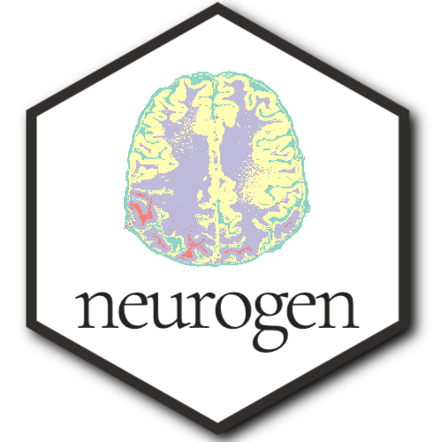

# neurogen 

An R package for creating generative art using Brain Imaging Data.  The `neurogen` package was born from a collaboration with brothers Daniel and [Tyler Wishard, UCLA](https://www.wishard.bio/c-v) for a proposal at the 2022 Organization of Human Brain Mapping in Glasgow, Scotland - which is titled ["Neuro-Fungible Tokens"](https://www.wishard.bio/art). Proceeds from the sale of any NFT's will be donated to organizations conducting neurological disease research.

Tyler is a Ph.D. candidate in the Neuroscience Interdisciplinary Program at UCLA whose work focuses on multimodal MRI to determine neuroimaging-based markers of age-related memory decline and optimize non-invasive neuromodulation to improve older adults' cognitive outcomes.

All example image data provided in package was produced using a 7-tesla MRI of Tyler Wishard's brain, aka 'Ty's Brain' and can be found in `inst/data`.


---


## Installation

```
devtools::install_github("jameswcraig/neurogen")
```

## Usage

```
library(neurogen)

# Get Ty's brain...
nii_path <- system.file(package = "neurogen", "data", "Ty_brain.nii.gz")

```

### Brain Infuse

Infuse selected color palette into greyscale image.

```
brain_infuse(file = nii_path,
             color_palette = RColorBrewer::brewer.pal(name = "Set3", n = 8),
             infuse_rate = 0.9,
             trim_start = 0.31,
             trim_end = 0.08)
)
```


### Brain Warp
  
Add a color warp to brain image.

```
brain_warp(file = nii_path,
           color_palette = RColorBrewer::brewer.pal(name = "Set3", n = 8))
)
```


